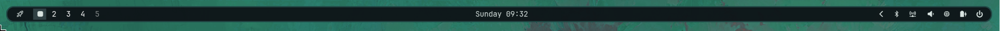

<div align="center">


**A dark Waybar theme built from the shared Leenium palette, tuned closer to Omarchy than to a flat accent theme.**

Hosted under `github.com/drunkleen/leenium.waybar`.



</div>

---

## Features

- **Omarchy-like layout** - pill modules, floating surfaces, and soft borders instead of a flat strip
- **Shared Leenium palette** - uses the same palette source of truth as the rest of the ecosystem
- **Waybar-friendly CSS** - a single importable stylesheet with common widget coverage
- **Low-glare UI** - restrained highlights and muted inactive states

---

## Install

1. Copy `style.css`and `config.jsonc` into your Waybar config directory.

```bash
mv ~/.config/waybar ~/.config/waybar.backup
git clone https://github.com/drunkleen/leenium.waybar.git ~/.config/waybar
```

2. Restart Waybar.

```bash
pkill waybar
waybar &
```

### Sample config

Use `config.jsonc` and `style.css` together for a more Omarchy-like setup.

### File layout

```text
~/.config/waybar/
  config.jsonc
  style.css
```

---

## Use

Recommended module setup:

- `workspaces`
- `clock`
- `network`
- `pulseaudio`
- `battery`
- `tray`

The theme is designed to feel closer to Omarchy's rounded, floating bar than to a minimal flat accent bar.

---

## The Leenium Ecosystem

Leenium is a unified dark desktop environment built around the same color palette. Alongside this Waybar theme, the project ships matching configs for:

- [**Firefox**](github.com/drunkleen/leenium.firefox) - browser theme extension
- [**Ghidra**](github.com/drunkleen/leenium.ghidra) - reverse engineering framework theme
- [**Hyprlock**](github.com/drunkleen/leenium.hyprlock) - hyprland lockscreen
- [**Limine**](github.com/drunkleen/leenium.limine) - BootLoader
- [**Neovim**](github.com/drunkleen/leenium.nvim) - syntax highlights and UI elements
- [**Omarchy**](github.com/drunkleen/leenium.omarchy) - desktop theme bundle
- [**OpenCode**](github.com/drunkleen/leenium.opencode) - terminal-first theme
- [**VS Code**](github.com/drunkleen/leenium.vscode) - editor theme and UI palette

Visit [github.com/drunkleen](https://github.com/drunkleen) or [leenium.drunkleen.com](https://leenium.drunkleen.com/) to explore the full setup.


<p align="center">
    Copyright &copy; 2026-present <a href="https://github.com/drunkleen" target="_blank">LEENIUM</a>
</p>
<p align="center">
    <a href="https://github.com/drunkleen/leenium.webpage/blob/master/LICENSE">
        
    </a>
</p>
